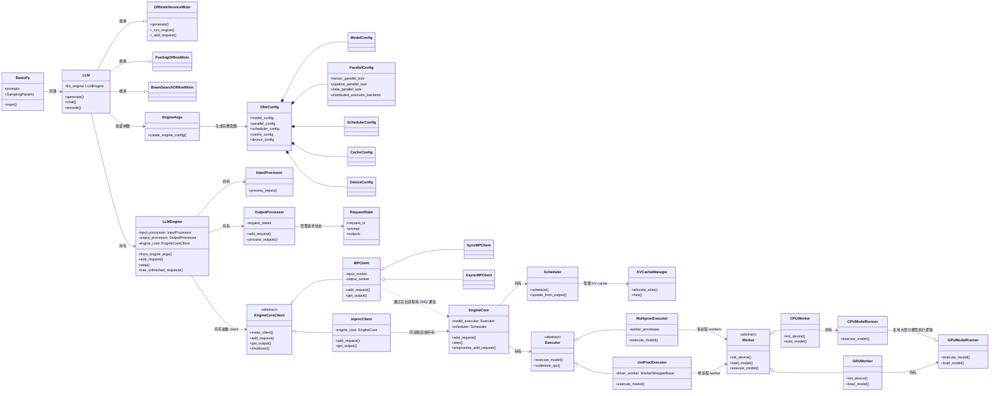
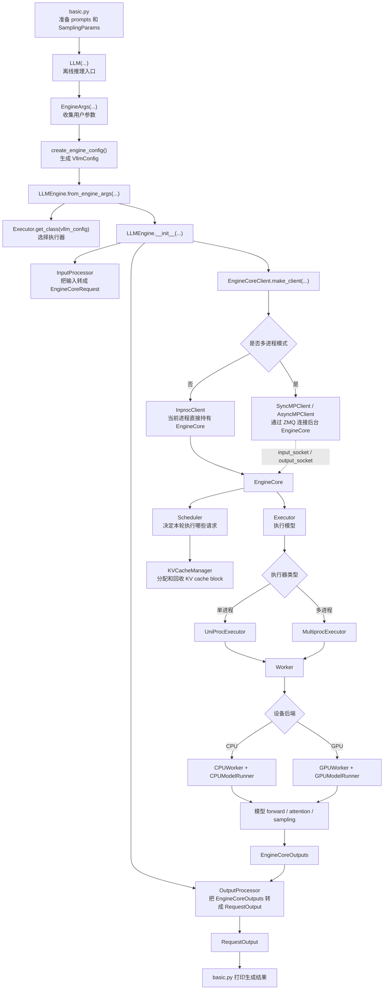
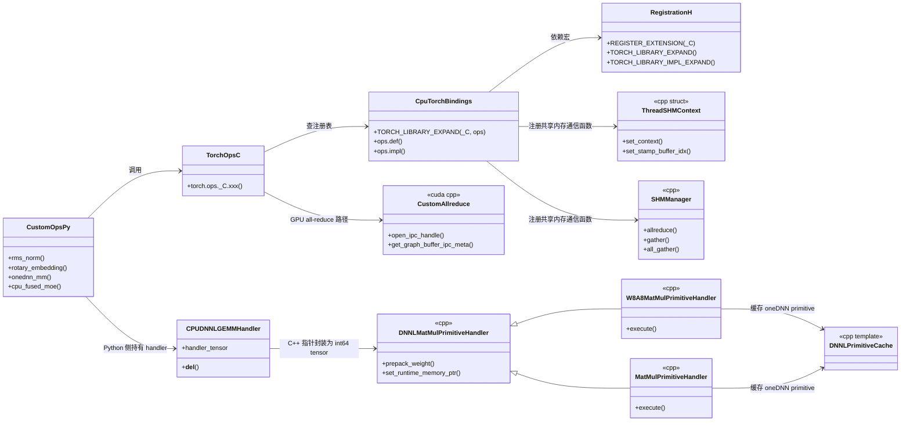

# vLLM 类图关系

这张图按 `examples/basic/offline_inference/basic.py` 的离线推理链路整理，
重点看 Python 层对象之间的关系：谁创建谁、谁持有谁、谁负责真正执行模型。

## 1. 核心类图



## 2. basic.py 请求流转图



## 3. C++ 扩展调用关系图

vLLM 的 C++ 调用通常不是 Python 直接 `ctypes` 调 C++ 类，而是走
PyTorch extension 机制：

```text
Python
  -> torch.ops._C.xxx(...)
  -> C++ TORCH_LIBRARY 注册表
  -> CPU / CUDA / ROCm 具体实现函数
```

把 Python 和 C++ 放在同一张图里看，会更清楚：

```mermaid
flowchart LR
    subgraph PY["Python 层"]
        A["ModelRunner<br/>CPUModelRunner / GPUModelRunner"]
        B["模型层代码<br/>cpu_attn.py / layernorm.py / scaled_mm/cpu.py"]
        C["from vllm import _custom_ops as ops"]
        D["vllm/_custom_ops.py<br/>Python wrapper"]
        E["current_platform.import_kernels()"]
        F["vllm/platforms/cpu.py<br/>CpuPlatform.import_kernels()"]
        G["CPUDNNLGEMMHandler<br/>Python 侧保存 C++ handler 指针"]
    end

    subgraph DISPATCH["PyTorch 扩展分发层"]
        H["import vllm._C<br/>或 _C_AVX512 / _C_AVX2"]
        I["REGISTER_EXTENSION(_C)<br/>让 Python import 能加载动态库"]
        J["TORCH_LIBRARY_EXPAND(_C, ops)<br/>注册 torch.ops._C namespace"]
        K["torch.ops._C.xxx(...)<br/>按 op 名称查注册表"]
    end

    subgraph CPP["C++ / CUDA / ROCm 实现层"]
        L["csrc/cpu/torch_bindings.cpp<br/>ops.def / ops.impl"]
        M["CPU kernel functions<br/>rms_norm / rotary_embedding / cpu_fused_moe"]
        N["oneDNN classes<br/>DNNLMatMulPrimitiveHandler<br/>W8A8MatMulPrimitiveHandler<br/>MatMulPrimitiveHandler"]
        O["CPU shared memory<br/>SHMManager / ThreadSHMContext"]
        P["csrc/torch_bindings.cpp<br/>CUDA legacy bindings"]
        Q["csrc/libtorch_stable/torch_bindings.cpp<br/>CUDA stable ABI bindings"]
        R["csrc/rocm/torch_bindings.cpp<br/>ROCm bindings"]
        S["GPU / ROCm kernels<br/>attention / layernorm / quantization / all-reduce"]
    end

    A --> B
    B --> C
    C --> D
    D -->|"模块首次加载时执行"| E
    E -->|"CPU 平台"| F
    F --> H
    H --> I
    I --> J
    J --> L

    D -->|"Python 函数封装"| K
    K -->|"例如 rms_norm"| L
    K -->|"例如 rotary_embedding"| L
    K -->|"例如 cpu_fused_moe"| L
    K -->|"例如 onednn_mm"| L
    K -->|"例如 init_cpu_memory_env"| L

    L --> M
    L --> N
    L --> O

    D -->|"create_onednn_mm()"| G
    G -->|"handler_tensor 保存 int64 指针"| N

    E -->|"CUDA 平台"| P
    E -->|"CUDA stable ABI"| Q
    P --> S
    Q --> S

    E -->|"ROCm 平台"| R
    R --> S

    classDef python fill:#dbeafe,stroke:#2563eb,color:#0f172a;
    classDef dispatch fill:#fef3c7,stroke:#d97706,color:#0f172a;
    classDef cpp fill:#dcfce7,stroke:#16a34a,color:#0f172a;

    class A,B,C,D,E,F,G python;
    class H,I,J,K dispatch;
    class L,M,N,O,P,Q,R,S cpp;
```



这张图里有三种关系：

- 蓝色：Python 代码，负责导入、包装参数、调用 `torch.ops._C.xxx(...)`。
- 黄色：PyTorch extension 分发层，负责把 `_C` 动态库加载进来，并根据 op 名称
  找到 C++ 注册函数。
- 绿色：C++ / CUDA / ROCm 实现层，负责真正执行 CPU kernel、GPU kernel、
  oneDNN GEMM、共享内存通信等底层逻辑。

如果只看“涉及到的类/结构”，核心是下面这些：



这里要注意两点：

- `torch.ops._C.xxx` 里的 `_C` 是 PyTorch 自定义算子 namespace，不是一个普通
  Python 类。
- C++ 侧很多地方是函数和模板结构，不一定是面向对象的“类调用”。比如
  `rms_norm`、`rotary_embedding`、`cpu_fused_moe` 主要是注册到
  `torch.ops._C` 的 C++ 函数。

## 4. 读图顺序

如果只看 `basic.py` 离线推理，可以按这个顺序读：

```text
basic.py
  -> LLM
  -> EngineArgs
  -> VllmConfig
  -> LLMEngine
  -> EngineCoreClient
  -> EngineCore
  -> Scheduler
  -> Executor
  -> Worker
  -> ModelRunner
```

这条链路里最容易混淆的是 `LLMEngine` 和 `EngineCore`：

- `LLMEngine` 更靠近用户 API，负责接收请求、处理输入输出、维护请求状态。
- `EngineCore` 更靠近执行循环，负责调度、KV cache、调用 executor 执行模型。
- `EngineCoreClient` 是中间层：同进程时直接调用 `EngineCore`，多进程时通过
  ZMQ 和后台 `EngineCore` 通信。

## 5. 对应代码位置

- [LLM](/Users/zyl/codes/mygithub/vllm/vllm/entrypoints/llm.py)
- [EngineArgs](/Users/zyl/codes/mygithub/vllm/vllm/engine/arg_utils.py)
- [VllmConfig](/Users/zyl/codes/mygithub/vllm/vllm/config/vllm.py)
- [ParallelConfig](/Users/zyl/codes/mygithub/vllm/vllm/config/parallel.py)
- [LLMEngine](/Users/zyl/codes/mygithub/vllm/vllm/v1/engine/llm_engine.py)
- [EngineCoreClient](/Users/zyl/codes/mygithub/vllm/vllm/v1/engine/core_client.py)
- [EngineCore](/Users/zyl/codes/mygithub/vllm/vllm/v1/engine/core.py)
- [OutputProcessor](/Users/zyl/codes/mygithub/vllm/vllm/v1/engine/output_processor.py)
- [Scheduler](/Users/zyl/codes/mygithub/vllm/vllm/v1/core/sched/scheduler.py)
- [KVCacheManager](/Users/zyl/codes/mygithub/vllm/vllm/v1/core/kv_cache_manager.py)
- [UniProcExecutor](/Users/zyl/codes/mygithub/vllm/vllm/v1/executor/uniproc_executor.py)
- [MultiprocExecutor](/Users/zyl/codes/mygithub/vllm/vllm/v1/executor/multiproc_executor.py)
- [CPUWorker](/Users/zyl/codes/mygithub/vllm/vllm/v1/worker/cpu_worker.py)
- [CPUModelRunner](/Users/zyl/codes/mygithub/vllm/vllm/v1/worker/cpu_model_runner.py)
- [GPUModelRunner](/Users/zyl/codes/mygithub/vllm/vllm/v1/worker/gpu/model_runner.py)
- [Python custom ops wrapper](/Users/zyl/codes/mygithub/vllm/vllm/_custom_ops.py)
- [CPU platform kernel import](/Users/zyl/codes/mygithub/vllm/vllm/platforms/cpu.py)
- [C++ extension registration macros](/Users/zyl/codes/mygithub/vllm/csrc/core/registration.h)
- [CPU torch bindings](/Users/zyl/codes/mygithub/vllm/csrc/cpu/torch_bindings.cpp)
- [CUDA torch bindings](/Users/zyl/codes/mygithub/vllm/csrc/torch_bindings.cpp)
- [Stable libtorch bindings](/Users/zyl/codes/mygithub/vllm/csrc/libtorch_stable/torch_bindings.cpp)
- [ROCm torch bindings](/Users/zyl/codes/mygithub/vllm/csrc/rocm/torch_bindings.cpp)
- [oneDNN handler classes](/Users/zyl/codes/mygithub/vllm/csrc/cpu/dnnl_helper.h)
- [CPU shared memory classes](/Users/zyl/codes/mygithub/vllm/csrc/cpu/shm.cpp)
- [CUDA CustomAllreduce](/Users/zyl/codes/mygithub/vllm/csrc/custom_all_reduce.cuh)
