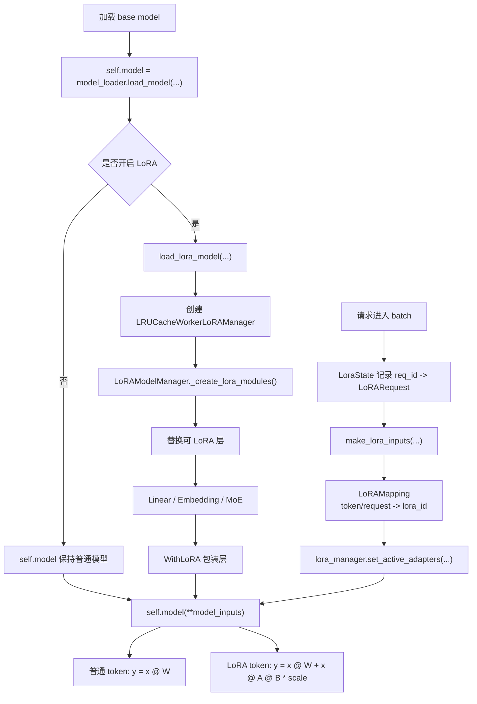

# vLLM LoRA 笔记

LoRA 可以理解成：**不修改原模型大权重，而是在部分线性层旁边挂一个很小的增量分支**。

原模型仍然是主体，LoRA adapter 只提供差异化能力。

```text
不用 LoRA:
  y = x @ W

使用 LoRA:
  y = x @ W + x @ A @ B * scale
```

其中：

- `W`：base model 原始权重，推理时不变
- `A/B`：LoRA adapter 里的低秩矩阵
- `scale`：LoRA 缩放系数

所以 LoRA 既不是复制一个完整模型，也不是直接覆盖原模型权重，而是给原模型部分层增加一个可切换的增量分支。

## 1. vLLM 中如何实现 LoRA

vLLM 的实现思路是：

```text
加载 base model
  -> 如果开启 LoRA，把 base model 的可 LoRA 层替换成 WithLoRA 包装层
  -> 请求进入 batch 时记录每个 request 使用哪个 LoRA
  -> 每次 forward 前设置 active LoRA mapping
  -> self.model(**model_inputs) 时，包装层自动计算 base + LoRA delta
```

核心不是“LoRA model 和 base model 串联”，而是：

```text
base model 的某些层
  Linear / Embedding / MoE
      ↓
  BaseLayerWithLoRA / BaseLinearLayerWithLoRA / FusedMoEWithLoRA
```

### 1.1 加载 base model 后包装 LoRA

入口在：

- [vllm/v1/worker/gpu/model_runner.py](/Users/zyl/codes/mygithub/vllm/vllm/v1/worker/gpu/model_runner.py)
- [vllm/v1/worker/lora_model_runner_mixin.py](/Users/zyl/codes/mygithub/vllm/vllm/v1/worker/lora_model_runner_mixin.py)

关键逻辑：

```python
self.model = model_loader.load_model(...)

if self.lora_config:
    self.model = self.load_lora_model(
        self.model,
        self.vllm_config,
        self.device,
    )
```

`load_lora_model(...)` 会创建 LoRA manager：

```python
self.lora_manager = LRUCacheWorkerLoRAManager(...)
return self.lora_manager.create_lora_manager(model, vllm_config)
```

这里返回的 `self.model` 还是同一个 base model 的主体，只是内部部分层已经被 LoRA manager 替换成支持 LoRA 的包装层。

### 1.2 LoRA manager 替换模型层

LoRA manager 的入口在：

- [vllm/lora/model_manager.py](/Users/zyl/codes/mygithub/vllm/vllm/lora/model_manager.py)
- [vllm/lora/layers/base.py](/Users/zyl/codes/mygithub/vllm/vllm/lora/layers/base.py)
- [vllm/lora/layers/base_linear.py](/Users/zyl/codes/mygithub/vllm/vllm/lora/layers/base_linear.py)
- [vllm/lora/layers/fused_moe.py](/Users/zyl/codes/mygithub/vllm/vllm/lora/layers/fused_moe.py)

大致关系是：

```text
LoRAModelManager
  -> _create_lora_modules()
  -> replace_submodule(...)
  -> 把原模块替换为 BaseLayerWithLoRA 子类
```

例如原始模型里可能有：

```text
q_proj
k_proj
v_proj
o_proj
gate_proj
up_proj
down_proj
```

启用 LoRA 后，这些模块会被替换成支持 LoRA 的包装模块。包装模块内部仍然保留 base layer，同时额外持有 LoRA adapter 权重。

### 1.3 每个 batch 前设置 active LoRA

LoRA 允许一个 batch 里同时存在：

```text
请求 A: base + LoRA 1
请求 B: base + LoRA 2
请求 C: base，不用 LoRA
```

所以 vLLM 需要在每步 forward 前告诉底层：

```text
哪个 request / token 用哪个 LoRA adapter
```

对应代码在 [vllm/v1/worker/gpu/model_runner.py](/Users/zyl/codes/mygithub/vllm/vllm/v1/worker/gpu/model_runner.py)：

```python
if self.lora_config:
    lora_inputs = self.lora_state.make_lora_inputs(
        input_batch.req_ids,
        input_batch.idx_mapping_np,
        input_batch.num_scheduled_tokens,
    )
    self._set_active_loras(*lora_inputs)
```

`lora_state` 记录：

```text
req_id -> LoRARequest
req_index -> lora_id
token -> lora_id
```

然后 `_set_active_loras(...)` 会构造 `LoRAMapping`：

```python
lora_mapping = LoRAMapping(
    token_lora_mapping,
    prompt_lora_mapping,
    is_prefill=True,
)
self.lora_manager.set_active_adapters(lora_requests, lora_mapping)
```

`LoRAMapping` 的作用是告诉底层：

```text
token 0 用 LoRA A
token 1 用 LoRA A
token 2 不用 LoRA
token 3 用 LoRA B
```

最后真正跑模型时仍然是：

```python
model_output = self.model(**model_inputs)
```

只是此时 `self.model` 内部已经带有 LoRA 包装层，包装层会根据 active mapping 自动加上 LoRA delta。

## 2. LoRA 原理

普通线性层可以写成：

```text
y = x @ W
```

如果完整微调，就是直接更新大矩阵 `W`。但大模型的 `W` 很大，训练和存储成本都高。

LoRA 的做法是冻结 `W`，只训练一个低秩增量：

```text
ΔW = A @ B
y = x @ W + x @ ΔW * scale
```

因为 `A` 和 `B` 的 rank 很小，所以参数量远少于完整的 `W`。

举个直观例子：

```text
W: 4096 x 4096
完整矩阵参数量: 16,777,216

A: 4096 x 8
B: 8 x 4096
LoRA 参数量: 65,536
```

这就是 LoRA 省参数、省存储、省部署成本的核心。

### 2.1 它是新增层还是修改权重？

从数学上看：

```text
不是直接修改 W
而是增加 ΔW
```

从工程实现上看：

```text
不是新增一个完整网络
而是把原有 Linear 层包装成支持 LoRA 的层
```

所以更准确的说法是：

```text
原层保留
原权重不变
旁边增加一个低秩增量分支
输出时 base output + LoRA delta
```

## 3. LoRA 的用途

LoRA 的核心价值是：**一个 base model 可以动态挂多个 adapter，用很低成本适配不同任务**。

常见用途：

- 低成本微调：不用训练完整大模型，只训练 LoRA 小矩阵
- 多任务切换：同一个 base model 挂多个 LoRA adapter
- 多租户推理：不同用户或业务使用不同 LoRA，但共享同一个 base model
- 节省显存/内存：不用为每个任务复制完整模型
- 快速实验：训练一个小 adapter 就能验证新任务、新风格、新数据集

在 vLLM 服务里，LoRA 特别适合这种场景：

```text
base model: Qwen / Llama

请求 A -> 法律 LoRA
请求 B -> 客服 LoRA
请求 C -> 代码 LoRA
请求 D -> 不用 LoRA
```

这些请求可以共享同一个 base model，并且可能在同一个 batch 里一起执行。

## 4. 总图



## 5. 代码入口

- [GPUModelRunner](/Users/zyl/codes/mygithub/vllm/vllm/v1/worker/gpu/model_runner.py)
- [LoRAModelRunnerMixin](/Users/zyl/codes/mygithub/vllm/vllm/v1/worker/lora_model_runner_mixin.py)
- [LoraState](/Users/zyl/codes/mygithub/vllm/vllm/v1/worker/gpu/lora_utils.py)
- [LoRAModelManager](/Users/zyl/codes/mygithub/vllm/vllm/lora/model_manager.py)
- [LoRAMapping](/Users/zyl/codes/mygithub/vllm/vllm/lora/layers/utils.py)
- [BaseLayerWithLoRA](/Users/zyl/codes/mygithub/vllm/vllm/lora/layers/base.py)
- [BaseLinearLayerWithLoRA](/Users/zyl/codes/mygithub/vllm/vllm/lora/layers/base_linear.py)
- [FusedMoEWithLoRA](/Users/zyl/codes/mygithub/vllm/vllm/lora/layers/fused_moe.py)
