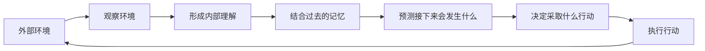

https://worldmodels.github.io/

## 世界模型的基础逻辑

世界模型的核心思想是：

> 智能体不仅对当前看到的内容做出反应，还会在内部形成一个对世界的理解，并根据过去的经历预测接下来可能发生什么。

整个过程会不断循环：

1. 智能体观察当前环境。
2. 将观察到的信息转换成自己能够理解的内部表示。
3. 结合过去的经历，判断当前处于什么状态。
4. 预测采取不同动作后可能发生的结果。
5. 选择一个动作并作用于环境。
6. 环境发生变化，智能体再次观察新的结果。

世界模型让智能体不必只依赖条件反射，而是能够利用过去的经验理解当前情况，并对未来做出预测。
