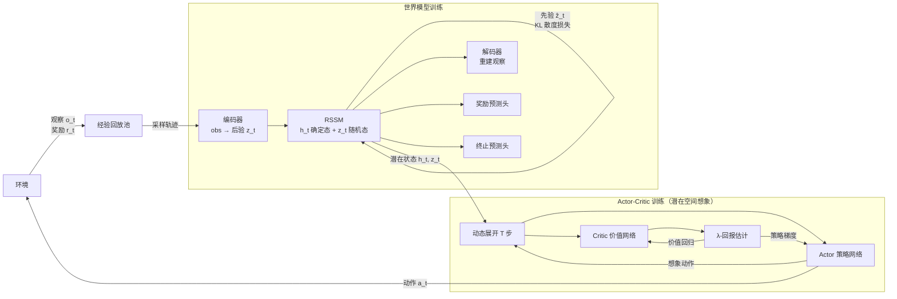

https://github.com/danijar/dreamerv3

DreamerV3 的核心思路：用真实环境数据训练一个世界模型，再完全在世界模型的潜在空间里做想象展开，训练 Actor-Critic，不需要再与真实环境交互。

整体分两个训练循环：
1. **世界模型训练**：从回放池采样真实轨迹，通过编码器 + RSSM 得到潜在状态，同时训练解码器、奖励头、终止头，并用 KL 散度约束先验与后验。
2. **Actor-Critic 训练**：以真实轨迹的潜在状态为起点，完全在 RSSM 内部展开 T 步想象，Actor 输出动作、RSSM 预测下一状态，Critic 估值后计算 λ-回报，反向优化 Actor 和 Critic。

关键设计：
- **RSSM（循环状态空间模型）**：包含确定态 `h_t`（GRU 隐状态）和随机态 `z_t`（离散类别分布），分离了序列记忆与随机性。
- **想象展开不需要真实环境**：Actor-Critic 的所有梯度都来自世界模型内部，样本效率极高。
- **Symlog 变换**：对奖励和价值做对称对数变换，解决跨任务量级差异大的问题，使得同一套超参数适用于几乎所有任务。