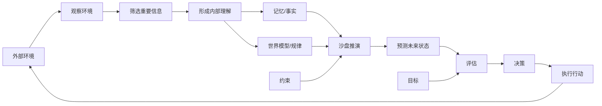
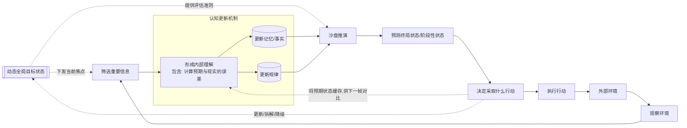
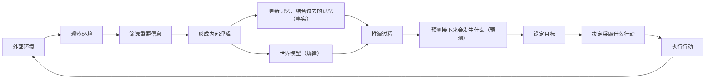

## 通用模型流程设计

### v3

gpt 更新的版本

- 本来准备加`RISK[风险/代价] --> EVALUATE`，但是RISK也可以认为是MEMORY和WORLDMODEL的一部分
- CONSTRAINT：当前资源/能力约束。约束（尤其是外部硬约束）往往不是"学来的"，而是外部强加的——比如预算上限、物理限制、规则边界

### v2

gemini给的一个版本，整体思路 ok，文案需要更新

- PREDICT到UNDERSTAND是一个短期记忆

### v1 （废弃）

- 相对于基础模型，增加的几个
    - ATTENTION：观察到的信息太多了。但你不会全部处理。
    - WORLDMODEL：世界模型，规律
    - SIMULATE：推演过程，PREDICT是预测结果
    - GOAL：人不会直接从预测进入决策。
- 在别的模型中，会多一个，执行完之后“获得奖励/获得反馈“，这个我理解可以归属于“UNDERSTAND“

## 世界模型的改进 与 codex/claudeCode 的对比

v3 更接近经典认知架构（ACT-R、模型预测控制）或模型化 RL agent，LLM-based agent 在高层概念上与 v3 一致，但内部实现有几处结构性差异。

**对应得上的部分**

| v3 节点 | Claude Code 实际对应 |
|---|---|
| GOAL | 用户的指令 / system prompt |
| CONSTRAINT | system prompt 里的限制、工具权限 |
| OBSERVE + ATTENTION | 读入 context window |
| DECIDE + ACTION | 选择并调用工具（bash / read / edit） |
| ENV | 文件系统、终端 |

**对应不上的部分**

- **MEMORY 不是"可更新的存储"**：Claude Code 没有持久化的外部记忆，真正的 MEMORY 就是 context window，它是只追加的，不是"每轮更新后再检索"的结构。
- **WORLDMODEL 是冻结的权重**：v3 里 UNDERSTAND → WORLDMODEL 暗示世界模型在运行时会更新，但 LLM 的"规律"是训练时烧进参数的，推理时不变。不存在"观察到新信息 → 更新规律"这个过程。
- **SIMULATE 不是独立阶段**：Claude Code 没有显式的"沙盘推演"模块，类似的推演发生在 chain-of-thought（thinking tokens）里，是同一次 forward pass 的一部分，不是架构上分离的节点。
- **EVALUATE 和 DECIDE 在同一次生成里完成**：LLM 一次生成就输出了推理 + 工具调用，没有先 EVALUATE 再 DECIDE 的时序分离。

## 参考

- ReAct Agent模型
- RL 模型

