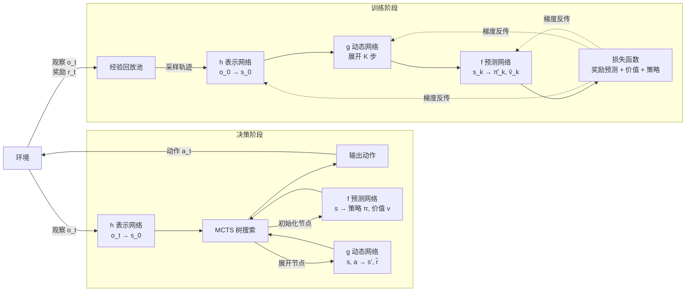

## MuZero

https://arxiv.org/abs/1911.08265

MuZero 在不知道环境规则的情况下，自己学一个世界模型，然后在潜在空间里用 MCTS 做规划。相比 AlphaZero 需要已知规则，MuZero 更通用。

**三个网络**：

| 网络 | 输入 → 输出 | 作用 |
|---|---|---|
| 表示网络 h | 观察 o_t → 隐状态 s_0 | 把真实观察压缩成潜在表示 |
| 动态网络 g | (s_t, a_t) → s_{t+1}, r̂_t | 在潜在空间预测下一状态和奖励 |
| 预测网络 f | s_t → 策略 π, 价值 v | 估计当前状态的动作分布和价值 |

- 决策阶段和训练阶段的 g、f 是同一套网络（共享权重）
- MCTS 完全在潜在空间里搜索，不需要真实环境参与
- 模型只预测"规划需要的量"（奖励、价值、策略），**不重建观察**——与 DreamerV3 的解码器不同

## 与 DreamerV3 的对比

| | MuZero | DreamerV3 |
|---|---|---|
| 规划方式 | MCTS 树搜索 | 想象展开 + Actor-Critic |
| 世界模型目标 | 只预测规划所需（r, v, π） | 重建观察（解码器） |
| 适用场景 | 离散动作、精确规划（棋类、Atari） | 连续控制、视觉输入的通用任务 |
| 样本效率 | 高（MCTS 充分利用模型） | 高（想象展开不依赖真实环境） |
