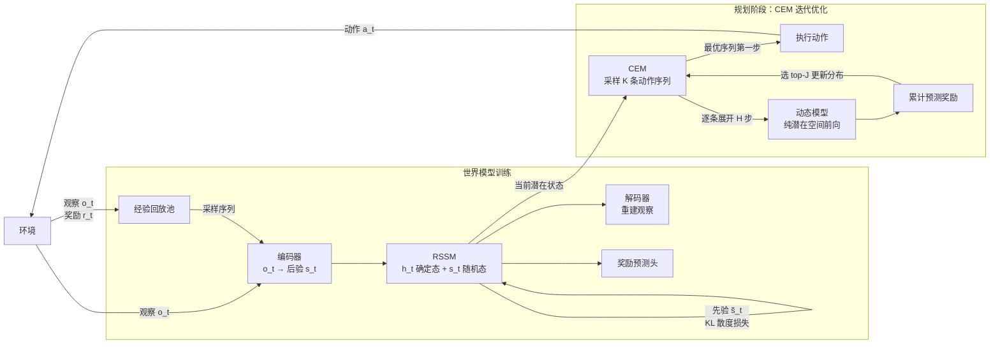

## PlaNet

https://arxiv.org/abs/1811.04551

PlaNet（Learning Latent Dynamics for Planning from Pixels）是 Dreamer 的前身。核心思路：学一个潜在动态模型（RSSM），然后在潜在空间里用 CEM（跨熵方法）直接优化动作序列，**没有显式的策略网络**，规划即决策。

**关键组件**：

| 组件 | 作用 |
|---|---|
| 编码器 | 观察 o_t → 后验随机状态 s_t |
| RSSM | 确定态 h_t（GRU）+ 随机态 s_t，维护时序上下文 |
| 解码器 | (h_t, s_t) → 重建观察（训练用） |
| 奖励预测头 | (h_t, s_t) → 预测奖励 r_t |
| CEM 规划器 | 在潜在空间采样动作序列，迭代筛选出最优序列 |

整体分两个阶段：
1. **世界模型训练**：从回放池采样真实轨迹，用 ELBO（重建损失 + KL散度 + 奖励预测损失）端到端训练 RSSM。
2. **规划阶段**：每步执行前，用 CEM 在潜在空间迭代优化动作序列——采样 → 展开 → 计算累计奖励 → 筛选 top-J → 重新采样，循环数次后取最优序列的第一步动作执行，然后重新规划（MPC 模式）。

## 与 DreamerV3 的对比

| | PlaNet | DreamerV3 |
|---|---|---|
| 决策方式 | CEM 在线规划（每步都搜索） | Actor 网络直接输出动作 |
| 有无策略网络 | 无，规划即策略 | 有 Actor-Critic |
| 执行速度 | 慢（每步需要多次模型展开） | 快（Actor 前向一次） |
| 世界模型目标 | 重建观察 + 奖励预测 | 重建观察 + 奖励预测（相同） |
| 核心创新 | 潜在空间 CEM 规划 | 想象中训练 Actor-Critic，去掉在线规划 |
