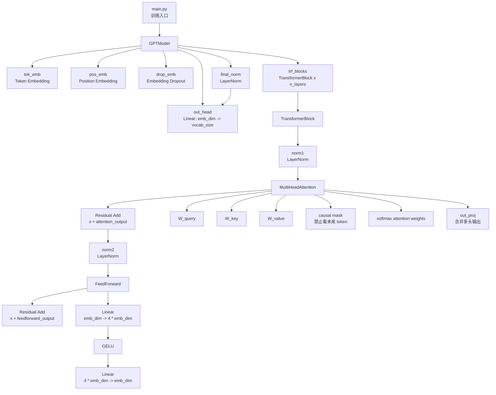

# llm-train-python 项目结构

项目代码位置：

```text
AI/codes/llm-train-python
```

其中模型相关代码在：

```text
AI/codes/llm-train-python/model
```

## Model Modules 关系图

```
GPTModel
├── token embedding: nn.Embedding
├── position embedding: nn.Embedding
├── dropout
├── TransformerBlock × n_layers
│   ├── LayerNorm
│   ├── MultiHeadAttention
│   │   ├── W_query
│   │   ├── W_key
│   │   ├── W_value
│   │   ├── causal mask
│   │   └── out_proj
│   ├── residual connection
│   ├── LayerNorm
│   ├── FeedForward
│   │   ├── Linear: emb_dim -> 4 * emb_dim
│   │   ├── GELU
│   │   └── Linear: 4 * emb_dim -> emb_dim
│   └── residual connection
├── final LayerNorm
└── output head: nn.Linear(emb_dim -> vocab_size)
```



## 数据流

输入是一批 token id：

```text
in_idx.shape = (batch_size, seq_len)
```

`GPTModel` 先把 token id 转成向量：

```text
token embedding + position embedding
```

然后经过多层 `TransformerBlock`。每个 `TransformerBlock` 内部有两段核心计算：

```text
x -> LayerNorm -> MultiHeadAttention -> Dropout -> Residual Add
x -> LayerNorm -> FeedForward       -> Dropout -> Residual Add
```

最后经过 `final_norm` 和 `out_head`，输出每个位置对词表中下一个 token 的预测分数：

```text
logits.shape = (batch_size, seq_len, vocab_size)
```

这里大部分中间层都保持同一个隐藏维度：

```text
x.shape = (batch_size, seq_len, emb_dim)
```

因此 `TransformerBlock` 可以重复堆叠。

## C++ 版本

项目代码位置：

```text
AI/codes/llm-train-cpp
```

这个目录是 `llm-train-python` 的 C++ 学习版，第一阶段只实现 CPU：

```text
AI/codes/llm-train-cpp
├── include/llm/               # public headers，llm.hpp 是聚合入口
│   ├── core.hpp
│   ├── tensor.hpp
│   ├── ops.hpp
│   ├── backend.hpp
│   ├── model.hpp
│   ├── data.hpp
│   ├── train.hpp
│   └── llm.hpp
├── src/                       # Tensor / Backend / Autograd / Model / Trainer 实现
│   ├── core/
│   ├── tensor/
│   ├── ops/
│   ├── backend/
│   ├── model/
│   ├── data/
│   └── train/
├── data/                      # GPT-2 BPE ranks 和 tokenizer 对照样例
├── examples/                  # train_gpt、generate_text 示例
├── tests/                     # 纯 C++ assert 测试入口
├── kernels/cuda/              # CUDA 占位
├── kernels/metal/             # Metal 占位
└── CMakeLists.txt
```

Python 到 C++ 的模块对应关系：

```text
AI/codes/llm-train-python/model/GPTModel.py
  -> GPTModel

AI/codes/llm-train-python/model/TransformerBlock.py
  -> TransformerBlock

AI/codes/llm-train-python/model/MultiHeadAttention.py
  -> MultiHeadAttention

AI/codes/llm-train-python/model/FeedForward.py
  -> FeedForward

AI/codes/llm-train-python/model/GELU.py
  -> GELU / ops::gelu

AI/codes/llm-train-python/model/LayerNorm.py
  -> LayerNorm / ops::layernorm

AI/codes/llm-train-python/tool/data_loader.py
  -> DataLoader

AI/codes/llm-train-python/train/train.py
  -> Trainer / AdamW / cross_entropy
```

构建与测试：

```bash
cmake -S AI/codes/llm-train-cpp -B /tmp/llm-train-cpp-build
cmake --build /tmp/llm-train-cpp-build
/tmp/llm-train-cpp-build/llm_cpp_tests
```

示例：

```bash
/tmp/llm-train-cpp-build/train_gpt
/tmp/llm-train-cpp-build/generate_text
```
